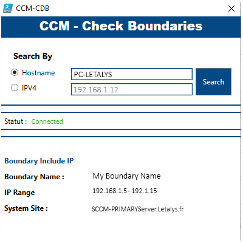

# Powershell : SCCM Check Device Boundaries UI

A simple interface to give you if a device is in a boudary limit, its give you the range IP of the bounary limit and the associated server (system site).



## Script configuration

You have to set your own properties to get it work with your SCCM infrastructure. (l28)

```
#region Variables
    $CCMServer = "<Your SCCM Server>"
    $CCMDrive = "<Your Site Code>"
    $DomainName = "<Your Domain>"
#endregion Variables
```
Check path for **ConfigurationManager.psd1**, modify if needed. (l39)

```
Import-module "C:\Program Files (x86)\Microsoft Endpoint Manager\bin\ConfigurationManager\ConfigurationManager.psd1"
```

## 🔗 Links
https://github.com/Letalys/Powershell-SCCM-CheckDeviceBoundariesUI


## Autor
- [@Letalys (GitHUb)](https://www.github.com/Letalys)